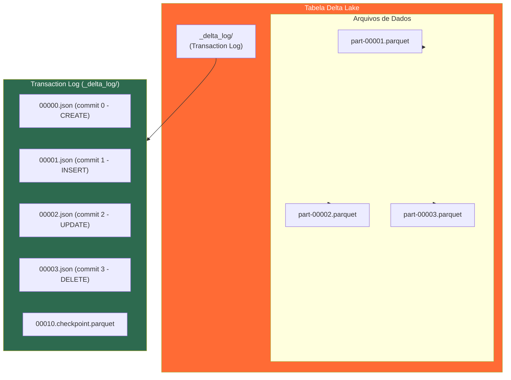

# Delta Lake

## O que é o Delta Lake?

**Delta Lake** é um formato de tabela open-source desenvolvido pela **Databricks** e doado à **Linux Foundation** em 2019. Ele adiciona uma camada de confiabilidade sobre Data Lakes existentes (como Amazon S3, Azure Data Lake Storage ou HDFS), trazendo propriedades **ACID** para cargas de trabalho de Big Data.

O Delta Lake armazena dados no formato **Parquet** e mantém um **transaction log** (também chamado de Delta Log) que registra todas as operações realizadas nas tabelas, permitindo reprodutibilidade, rollback e auditoria.

---

## Arquitetura do Delta Lake



### Transaction Log

O **Delta Log** é um diretório `_delta_log/` criado dentro do diretório da tabela. Cada commit gera um arquivo JSON numerado sequencialmente:

```
tabela_delta/
├── _delta_log/
│   ├── 00000000000000000000.json    ← criação da tabela
│   ├── 00000000000000000001.json    ← primeiro INSERT
│   ├── 00000000000000000002.json    ← UPDATE
│   ├── 00000000000000000003.json    ← DELETE
│   └── 00000000000000000010.checkpoint.parquet  ← checkpoint
├── part-00000-abc123.parquet
├── part-00001-def456.parquet
└── part-00002-ghi789.parquet
```

Cada arquivo JSON contém ações como:
- `add`: arquivo Parquet adicionado à tabela
- `remove`: arquivo Parquet marcado para remoção (soft delete)
- `metaData`: schema e configurações da tabela
- `commitInfo`: metadados do commit (operação, timestamp, usuário)

---

## Propriedades ACID

| Propriedade | Descrição | Como o Delta implementa |
|-------------|-----------|------------------------|
| **Atomicidade** | A transação é totalmente concluída ou não ocorre | Escrita atômica de commits no log |
| **Consistência** | Os dados sempre passam de um estado válido para outro | Validação de schema e constraints |
| **Isolamento** | Transações concorrentes não se interferem | Optimistic concurrency control |
| **Durabilidade** | Dados commitados são persistentes | Arquivos Parquet + log imutável |

---

## Configuração do Delta Lake com PySpark

```python
from pyspark.sql import SparkSession
from delta import configure_spark_with_delta_pip

# Criar SparkSession com Delta Lake
builder = SparkSession.builder \
    .appName("DeltaLake") \
    .master("local[*]") \
    .config("spark.sql.extensions",
            "io.delta.sql.DeltaSparkSessionExtension") \
    .config("spark.sql.catalog.spark_catalog",
            "org.apache.spark.sql.delta.catalog.DeltaCatalog")

spark = configure_spark_with_delta_pip(builder).getOrCreate()
spark.sparkContext.setLogLevel("ERROR")
```

---

## Operações CRUD com Delta Lake

### INSERT — Escrita Inicial

```python
from pyspark.sql.types import StructType, StructField, IntegerType, StringType, DoubleType

schema = StructType([
    StructField("cliente_id", IntegerType(), False),
    StructField("nome",       StringType(),  False),
    StructField("email",      StringType(),  False),
    StructField("cidade",     StringType(),  True),
    StructField("estado",     StringType(),  True),
])

dados = [
    (1, "Alice Souza",   "alice@email.com",   "Criciúma",    "SC"),
    (2, "Bruno Oliveira","bruno@email.com",   "Florianópolis","SC"),
    (3, "Carla Mendes",  "carla@email.com",   "São Paulo",   "SP"),
]

df = spark.createDataFrame(dados, schema=schema)

# Escrever como tabela Delta
df.write.format("delta") \
    .mode("overwrite") \
    .save("warehouse/delta/clientes")

print("Tabela Delta criada com sucesso!")
```

### UPDATE — Atualizar Registros

```python
from delta.tables import DeltaTable

# Carregar a tabela Delta
delta_table = DeltaTable.forPath(spark, "warehouse/delta/clientes")

# Atualizar cidade de um cliente específico
delta_table.update(
    condition="cliente_id = 1",
    set={"cidade": "'Tubarão'", "estado": "'SC'"}
)

# Verificar a atualização
spark.read.format("delta") \
    .load("warehouse/delta/clientes") \
    .filter("cliente_id = 1") \
    .show()
```

### DELETE — Remover Registros

```python
# Remover cliente por ID
delta_table.delete(condition="cliente_id = 3")

# Verificar remoção
spark.read.format("delta") \
    .load("warehouse/delta/clientes") \
    .show()
```

### MERGE (Upsert) — INSERT ou UPDATE

```python
# Novos dados: atualiza existentes, insere novos
novos_clientes = spark.createDataFrame([
    (2, "Bruno O. Silva", "bruno@email.com", "Joinville", "SC"),  # update
    (4, "Diana Costa",   "diana@email.com", "Curitiba",  "PR"),  # insert
], schema=schema)

delta_table.alias("destino").merge(
    novos_clientes.alias("fonte"),
    "destino.cliente_id = fonte.cliente_id"
).whenMatchedUpdate(set={
    "nome":   "fonte.nome",
    "cidade": "fonte.cidade",
    "estado": "fonte.estado",
}).whenNotMatchedInsert(values={
    "cliente_id": "fonte.cliente_id",
    "nome":       "fonte.nome",
    "email":      "fonte.email",
    "cidade":     "fonte.cidade",
    "estado":     "fonte.estado",
}).execute()
```

---

## Time Travel (Viagem no Tempo)

O Delta Lake mantém o histórico completo de versões da tabela:

```python
# Listar todo o histórico de versões
delta_table.history().select(
    "version", "timestamp", "operation", "operationParameters"
).show(truncate=False)

# Ler uma versão específica (por número de versão)
df_v0 = spark.read.format("delta") \
    .option("versionAsOf", 0) \
    .load("warehouse/delta/clientes")
df_v0.show()

# Ler por timestamp
df_historico = spark.read.format("delta") \
    .option("timestampAsOf", "2025-01-15 10:00:00") \
    .load("warehouse/delta/clientes")

# Via SQL (requer tabela registrada no catálogo)
spark.sql("""
    SELECT * FROM delta.`warehouse/delta/clientes`
    VERSION AS OF 0
""").show()
```

---

## Schema Evolution (Evolução de Schema)

```python
# Adicionar novas colunas sem recriar a tabela
df_com_telefone = spark.createDataFrame([
    (5, "Eduardo Lima", "edu@email.com", "Porto Alegre", "RS", "48999999999"),
], ["cliente_id", "nome", "email", "cidade", "estado", "telefone"])

df_com_telefone.write.format("delta") \
    .mode("append") \
    .option("mergeSchema", "true") \   # permite adicionar nova coluna
    .save("warehouse/delta/clientes")
```

---

## Vacuum — Limpeza de Arquivos Antigos

O `VACUUM` remove arquivos Parquet que não são mais referenciados pelo log:

```python
from delta.tables import DeltaTable

delta_table = DeltaTable.forPath(spark, "warehouse/delta/clientes")

# Remover arquivos com mais de 0 horas (default: 168h = 7 dias)
# ATENÇÃO: remover arquivos muito recentes impossibilita time travel
delta_table.vacuum(retentionHours=0)  # apenas para ambiente de dev
```

---

## Delta Lake via SQL

O Delta Lake suporta DDL/DML SQL padrão quando a tabela é gerenciada pelo catálogo Spark:

```sql
-- Criar tabela Delta via SQL
CREATE TABLE IF NOT EXISTS clientes_sql (
    cliente_id INT,
    nome       STRING,
    email      STRING,
    cidade     STRING,
    estado     STRING
) USING delta
LOCATION 'warehouse/delta/clientes_sql';

-- INSERT
INSERT INTO clientes_sql VALUES (1, 'Ana Lima', 'ana@email.com', 'Criciúma', 'SC');

-- UPDATE
UPDATE clientes_sql SET cidade = 'Tubarão' WHERE cliente_id = 1;

-- DELETE
DELETE FROM clientes_sql WHERE estado = 'RJ';

-- Verificar histórico
DESCRIBE HISTORY clientes_sql;
```

---

## Comparação com Formatos Tradicionais

| Característica | Parquet Simples | Delta Lake |
|----------------|-----------------|------------|
| ACID | ❌ | ✅ |
| Time Travel | ❌ | ✅ |
| Upsert/Merge | ❌ | ✅ |
| Schema Evolution | Manual | ✅ Automático |
| Auditoria | ❌ | ✅ |
| Leituras concorrentes | ✅ | ✅ |
| Escritas concorrentes | ❌ | ✅ (OCC) |
| Compatibilidade Parquet | — | ✅ (é Parquet por baixo) |

---

## Casos de Uso Ideais

- **CDC (Change Data Capture)**: capturar mudanças de bancos transacionais e aplicar no lakehouse.
- **Streaming + Batch**: unificar dados em tempo real e históricos na mesma tabela.
- **Correção de dados**: usar UPDATE/DELETE para corrigir erros sem reprocessar tudo.
- **Compliance/LGPD**: deletar dados de um usuário específico com garantia ACID.
- **Machine Learning**: garantir reprodutibilidade de datasets com time travel.
