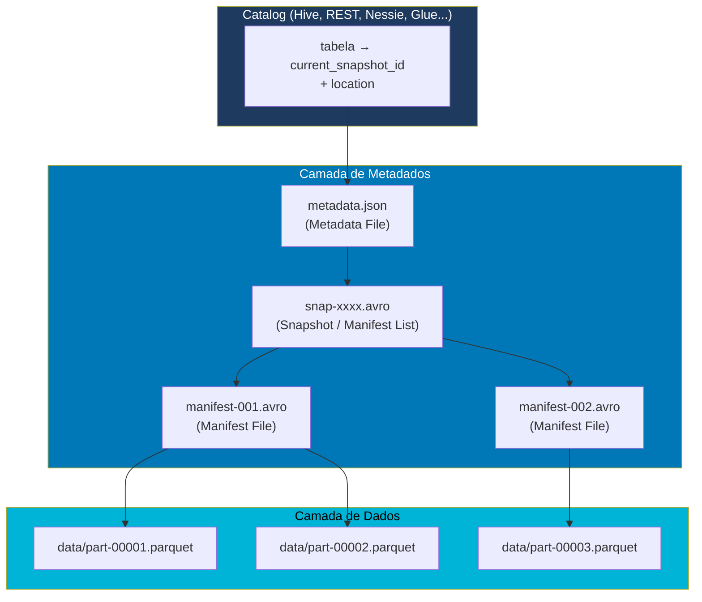
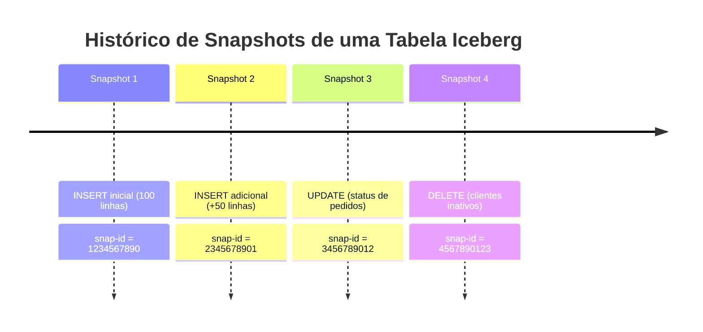

# Apache Iceberg

## O que é o Apache Iceberg?

**Apache Iceberg** é um formato de tabela open-source de alto desempenho para grandes conjuntos de dados analíticos. Originalmente desenvolvido pela **Netflix** e doado para a **Apache Software Foundation** em 2018, o Iceberg foi criado para resolver problemas críticos de escalabilidade e confiabilidade que surgem ao trabalhar com tabelas Hive em escala petabyte.

O Iceberg é uma **especificação aberta** — qualquer motor de processamento (Spark, Flink, Trino, Hive, Dremio, etc.) pode ler e escrever tabelas Iceberg, tornando-o ideal para ambientes multi-engine.

---

## Arquitetura do Apache Iceberg



### Três Camadas do Iceberg

| Camada | Componente | Função |
|--------|-----------|--------|
| **Catálogo** | Catalog (Hive, REST, Nessie) | Mapeia nome da tabela → localização dos metadados |
| **Metadados** | Metadata File (.json) | Schema, partições, snapshots, propriedades |
| **Metadados** | Manifest List (.avro) | Lista de manifest files por snapshot |
| **Metadados** | Manifest File (.avro) | Lista de arquivos de dados com estatísticas |
| **Dados** | Parquet / ORC / Avro | Dados reais armazenados |

---

## Conceito de Snapshots

Cada operação de escrita no Iceberg gera um novo **snapshot** — uma foto imutável do estado da tabela naquele momento:



---

## Configuração do Iceberg com PySpark

```python
from pyspark.sql import SparkSession

ICEBERG_VERSION = "1.6.1"
SPARK_VERSION   = "3.5"
SCALA_VERSION   = "2.12"
JAR = (
    f"org.apache.iceberg:iceberg-spark-runtime"
    f"-{SPARK_VERSION}_{SCALA_VERSION}:{ICEBERG_VERSION}"
)

spark = SparkSession.builder \
    .appName("ApacheIceberg") \
    .master("local[*]") \
    .config("spark.jars.packages", JAR) \
    .config("spark.sql.extensions",
            "org.apache.iceberg.spark.extensions.IcebergSparkSessionExtensions") \
    .config("spark.sql.catalog.local",
            "org.apache.iceberg.spark.SparkCatalog") \
    .config("spark.sql.catalog.local.type", "hadoop") \
    .config("spark.sql.catalog.local.warehouse", "warehouse/iceberg") \
    .config("spark.sql.defaultCatalog", "local") \
    .getOrCreate()

spark.sparkContext.setLogLevel("ERROR")
```

---

## Operações CRUD com Apache Iceberg

### Criar Banco de Dados e Tabela

```python
# Criar namespace (banco de dados)
spark.sql("CREATE NAMESPACE IF NOT EXISTS local.techstore")

# Criar tabela Iceberg via SQL
spark.sql("""
    CREATE TABLE IF NOT EXISTS local.techstore.clientes (
        cliente_id   INT    NOT NULL,
        nome         STRING NOT NULL,
        email        STRING NOT NULL,
        cidade       STRING,
        estado       STRING
    )
    USING iceberg
    PARTITIONED BY (estado)
""")
```

### INSERT — Inserir Dados

```python
# Via DataFrame
from pyspark.sql.types import StructType, StructField, IntegerType, StringType

schema = StructType([
    StructField("cliente_id", IntegerType(), False),
    StructField("nome",       StringType(),  False),
    StructField("email",      StringType(),  False),
    StructField("cidade",     StringType(),  True),
    StructField("estado",     StringType(),  True),
])

dados = [
    (1, "Alice Souza",    "alice@email.com",  "Criciúma",     "SC"),
    (2, "Bruno Oliveira", "bruno@email.com",  "Florianópolis","SC"),
    (3, "Carla Mendes",   "carla@email.com",  "São Paulo",    "SP"),
    (4, "Diego Alves",    "diego@email.com",  "Curitiba",     "PR"),
]

df = spark.createDataFrame(dados, schema=schema)

df.writeTo("local.techstore.clientes") \
  .append()

# Via SQL
spark.sql("""
    INSERT INTO local.techstore.clientes VALUES
    (5, 'Eduardo Lima', 'edu@email.com', 'Porto Alegre', 'RS')
""")
```

### UPDATE — Atualizar Registros

```python
# Atualizar cidade de um cliente
spark.sql("""
    UPDATE local.techstore.clientes
    SET cidade = 'Tubarão'
    WHERE cliente_id = 1
""")

# Verificar resultado
spark.sql("""
    SELECT * FROM local.techstore.clientes
    WHERE cliente_id = 1
""").show()
```

### DELETE — Remover Registros

```python
# Remover cliente específico
spark.sql("""
    DELETE FROM local.techstore.clientes
    WHERE cliente_id = 3
""")

# Verificar tabela após remoção
spark.sql("SELECT * FROM local.techstore.clientes ORDER BY cliente_id").show()
```

### MERGE (Upsert)

```python
# Criar tabela temporária com dados novos/atualizados
spark.sql("""
    CREATE OR REPLACE TEMPORARY VIEW novos_clientes AS
    SELECT * FROM VALUES
        (2, 'Bruno O. Silva', 'bruno@email.com', 'Joinville', 'SC'),
        (6, 'Fernanda Rocha', 'fe@email.com',    'Salvador',  'BA')
    AS t(cliente_id, nome, email, cidade, estado)
""")

# MERGE INTO
spark.sql("""
    MERGE INTO local.techstore.clientes AS destino
    USING novos_clientes AS fonte
    ON destino.cliente_id = fonte.cliente_id
    WHEN MATCHED THEN
        UPDATE SET
            destino.nome   = fonte.nome,
            destino.cidade = fonte.cidade,
            destino.estado = fonte.estado
    WHEN NOT MATCHED THEN
        INSERT (cliente_id, nome, email, cidade, estado)
        VALUES (fonte.cliente_id, fonte.nome, fonte.email,
                fonte.cidade, fonte.estado)
""")
```

---

## Time Travel (Viagem no Tempo)

```python
# Listar todos os snapshots da tabela
spark.sql("""
    SELECT snapshot_id, committed_at, operation, summary
    FROM local.techstore.clientes.snapshots
    ORDER BY committed_at
""").show(truncate=False)

# Ler dados de um snapshot específico
spark.sql("""
    SELECT * FROM local.techstore.clientes
    FOR SYSTEM_VERSION AS OF <snapshot_id>
""").show()

# Ler dados de um timestamp específico
spark.sql("""
    SELECT * FROM local.techstore.clientes
    FOR SYSTEM_TIME AS OF '2025-01-15 10:00:00'
""").show()

# Via DataFrame API
df_historico = spark.read \
    .option("snapshot-id", "<snapshot_id>") \
    .table("local.techstore.clientes")
```

---

## Partition Evolution (Evolução de Particionamento)

Uma das grandes vantagens do Iceberg sobre o Hive é a capacidade de **mudar o particionamento sem reescrever os dados**:

```python
# Criar tabela particionada por 'estado'
spark.sql("""
    CREATE TABLE local.techstore.pedidos (
        pedido_id   INT,
        cliente_id  INT,
        data_pedido DATE,
        status      STRING,
        valor_total DOUBLE
    )
    USING iceberg
    PARTITIONED BY (estado_cliente STRING, months(data_pedido))
""")

# Adicionar nova partição SEM reescrever dados antigos
spark.sql("""
    ALTER TABLE local.techstore.pedidos
    ADD PARTITION FIELD days(data_pedido)
""")

# Remover partição antiga
spark.sql("""
    ALTER TABLE local.techstore.pedidos
    DROP PARTITION FIELD months(data_pedido)
""")
```

---

## Schema Evolution (Evolução de Schema)

```python
# Adicionar coluna
spark.sql("""
    ALTER TABLE local.techstore.clientes
    ADD COLUMN telefone STRING AFTER email
""")

# Renomear coluna
spark.sql("""
    ALTER TABLE local.techstore.clientes
    RENAME COLUMN cidade TO municipio
""")

# Alterar tipo de coluna (widening apenas: int → long → float → double → decimal)
spark.sql("""
    ALTER TABLE local.techstore.clientes
    ALTER COLUMN cliente_id TYPE BIGINT
""")

# Remover coluna
spark.sql("""
    ALTER TABLE local.techstore.clientes
    DROP COLUMN telefone
""")
```

---

## Manutenção de Tabelas Iceberg

```python
# Compactar arquivos pequenos (bin-packing)
spark.sql("""
    CALL local.system.rewrite_data_files(
        table => 'local.techstore.clientes',
        options => map('target-file-size-bytes', '134217728')
    )
""")

# Expirar snapshots antigos (manter últimas 24 horas)
spark.sql("""
    CALL local.system.expire_snapshots(
        table => 'local.techstore.clientes',
        older_than => TIMESTAMP '2025-01-01 00:00:00',
        retain_last => 5
    )
""")

# Remover arquivos órfãos
spark.sql("""
    CALL local.system.remove_orphan_files(
        table => 'local.techstore.clientes'
    )
""")
```

---

## Delta Lake vs Apache Iceberg

| Característica | Delta Lake | Apache Iceberg |
|----------------|-----------|----------------|
| **Origem** | Databricks (2019) | Netflix / Apache (2018) |
| **Governança** | Linux Foundation | Apache Software Foundation |
| **Spec. aberta** | Parcial | ✅ Totalmente aberta |
| **Multi-engine** | Bom | ✅ Excelente (design-first) |
| **Catalog** | Spark catalog | Hive, REST, Nessie, Glue... |
| **ACID** | ✅ | ✅ |
| **Time Travel** | Por versão/timestamp | Por snapshot/timestamp |
| **Partition Evolution** | Limitado | ✅ Avançado |
| **Schema Evolution** | ✅ | ✅ |
| **Formato dos dados** | Parquet | Parquet, ORC, Avro |
| **Tamanho de tabelas** | Bom | ✅ Otimizado para PB |
| **Streaming** | ✅ (Delta Streaming) | ✅ (via Flink/Spark) |
| **Integração Databricks** | ✅ Nativa | Suportado |

---

## Casos de Uso Ideais

- **Ambientes multi-engine**: tabelas consumidas por Spark, Trino, Flink e Hive simultaneamente.
- **Tabelas petabyte**: o design de metadados em três camadas escala melhor que o Delta Log para tabelas muito grandes.
- **Partition Evolution**: migrar particionamento sem reescrever dados históricos.
- **Lakehouse aberto**: projetos que precisam de portabilidade máxima e independência de fornecedor.
- **Dados geoespaciais/temporais**: funções de particionamento nativas (hours, days, months, years, bucket, truncate).
