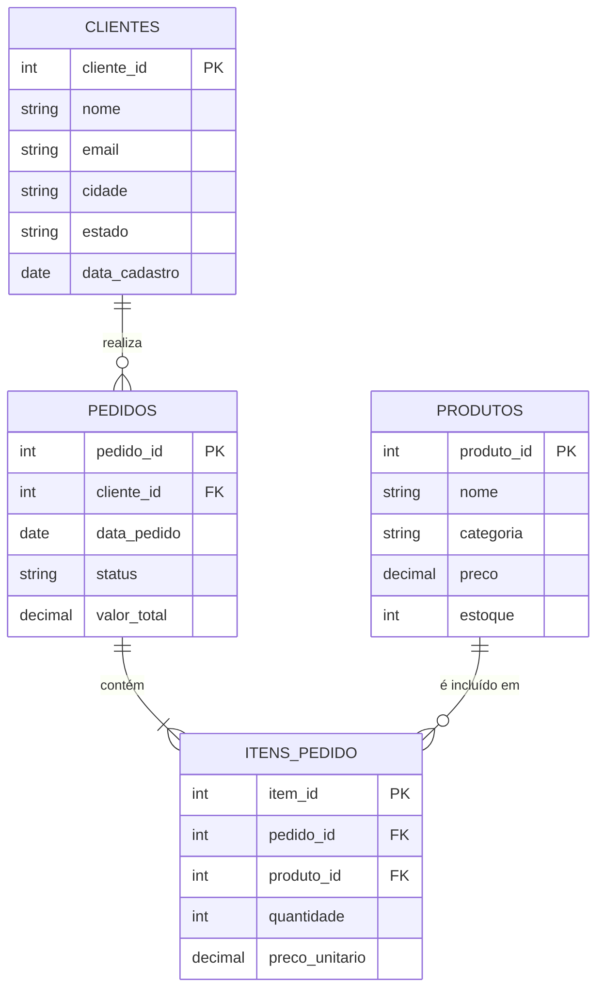

# Contextualização do Trabalho

## Visão Geral

Este projeto explora o ecossistema moderno de **Data Lakehouse**, combinando o poder de processamento distribuído do **Apache Spark** com dois dos formatos de tabela open-source mais relevantes do mercado: **Delta Lake** e **Apache Iceberg**.

O trabalho foi desenvolvido como atividade avaliativa da disciplina de **Arquitetura de Dados** da **SATC – Associação Beneficente da Indústria Carbonífera de Santa Catarina**.

---

## Cenário de Negócio: TechStore — Loja Virtual

O cenário escolhido simula o sistema transacional de uma loja virtual chamada **TechStore**, que vende produtos eletrônicos. As operações de INSERT, UPDATE e DELETE representam situações reais do dia a dia de um e-commerce:

- **Clientes** se cadastram, atualizam seus dados e podem ser removidos da base.
- **Produtos** têm preços e estoque atualizados com frequência.
- **Pedidos** passam por mudanças de status ao longo do tempo.
- **Itens de pedido** registram o que foi comprado em cada transação.

---

## Modelo Entidade-Relacionamento



---

## DDL das Tabelas (SQL padrão)

### Tabela `clientes`

```sql
CREATE TABLE clientes (
    cliente_id   INT          NOT NULL,
    nome         VARCHAR(100) NOT NULL,
    email        VARCHAR(150) NOT NULL UNIQUE,
    cidade       VARCHAR(80),
    estado       CHAR(2),
    data_cadastro DATE        NOT NULL,
    PRIMARY KEY (cliente_id)
);
```

### Tabela `produtos`

```sql
CREATE TABLE produtos (
    produto_id  INT            NOT NULL,
    nome        VARCHAR(150)   NOT NULL,
    categoria   VARCHAR(80)    NOT NULL,
    preco       DECIMAL(10, 2) NOT NULL,
    estoque     INT            NOT NULL DEFAULT 0,
    PRIMARY KEY (produto_id)
);
```

### Tabela `pedidos`

```sql
CREATE TABLE pedidos (
    pedido_id    INT            NOT NULL,
    cliente_id   INT            NOT NULL,
    data_pedido  DATE           NOT NULL,
    status       VARCHAR(30)    NOT NULL DEFAULT 'PENDENTE',
    valor_total  DECIMAL(12, 2) NOT NULL,
    PRIMARY KEY (pedido_id),
    FOREIGN KEY (cliente_id) REFERENCES clientes(cliente_id)
);
```

### Tabela `itens_pedido`

```sql
CREATE TABLE itens_pedido (
    item_id        INT            NOT NULL,
    pedido_id      INT            NOT NULL,
    produto_id     INT            NOT NULL,
    quantidade     INT            NOT NULL,
    preco_unitario DECIMAL(10, 2) NOT NULL,
    PRIMARY KEY (item_id),
    FOREIGN KEY (pedido_id)  REFERENCES pedidos(pedido_id),
    FOREIGN KEY (produto_id) REFERENCES produtos(produto_id)
);
```

---

## Fonte de Dados

Os dados utilizados nos notebooks são **sintéticos**, gerados pela biblioteca [Faker](https://faker.readthedocs.io/en/master/) para Python. Essa abordagem garante:

- Reprodutibilidade total (sem dependência de APIs externas ou arquivos externos).
- Dados realistas com nomes, e-mails e cidades brasileiras.
- Volume configurável para simular cenários de médio porte.

### Volume de Dados Gerado

| Tabela        | Registros |
|---------------|-----------|
| clientes      | 100       |
| produtos      | 30        |
| pedidos       | 200       |
| itens_pedido  | ~500      |

---

## Tecnologias Utilizadas

| Tecnologia        | Versão  | Função                                      |
|-------------------|---------|---------------------------------------------|
| Python            | 3.11    | Linguagem principal                         |
| Apache Spark      | 3.5.3   | Motor de processamento distribuído          |
| PySpark           | 3.5.3   | API Python para o Spark                     |
| Delta Lake        | 3.2.0   | Formato de tabela open-source (ACID)        |
| Apache Iceberg    | 1.6.1   | Formato de tabela open-source (open std.)   |
| JupyterLab        | 4.x     | Ambiente interativo de notebooks            |
| UV                | latest  | Gerenciador de pacotes e projetos Python    |
| MKDocs Material   | 9.x     | Geração da documentação web                 |

---

## Estrutura do Projeto

```
spark-lakehouse/
├── .python-version          # Versão do Python (3.11)
├── pyproject.toml           # Configuração do projeto e dependências (UV)
├── uv.lock                  # Lock file gerado pelo UV
├── README.md                # Instruções de reprodução do ambiente
├── mkdocs.yml               # Configuração da documentação web
├── notebooks/
│   ├── delta_lake.ipynb     # Notebook: Delta Lake com PySpark
│   └── iceberg.ipynb        # Notebook: Apache Iceberg com PySpark
└── docs/
    ├── index.md             # Esta página — contextualização
    ├── spark.md             # Apache Spark / PySpark
    ├── delta.md             # Delta Lake
    └── iceberg.md           # Apache Iceberg
```

---

## Operações Demonstradas

Ambos os notebooks cobrem as mesmas operações fundamentais de manipulação de dados, permitindo uma **comparação direta** entre Delta Lake e Iceberg:

| Operação | Delta Lake | Apache Iceberg |
|----------|-----------|----------------|
| INSERT   | ✅ `df.write.format("delta")` | ✅ `df.write.format("iceberg")` |
| UPDATE   | ✅ `DeltaTable.update()` | ✅ `spark.sql("UPDATE ...")` |
| DELETE   | ✅ `DeltaTable.delete()` | ✅ `spark.sql("DELETE ...")` |
| MERGE    | ✅ `DeltaTable.merge()` | ✅ `spark.sql("MERGE INTO ...")` |
| Time Travel | ✅ `VERSION AS OF` | ✅ `FOR SYSTEM_TIME AS OF` |
| Schema Evolution | ✅ `mergeSchema` | ✅ Automático |
