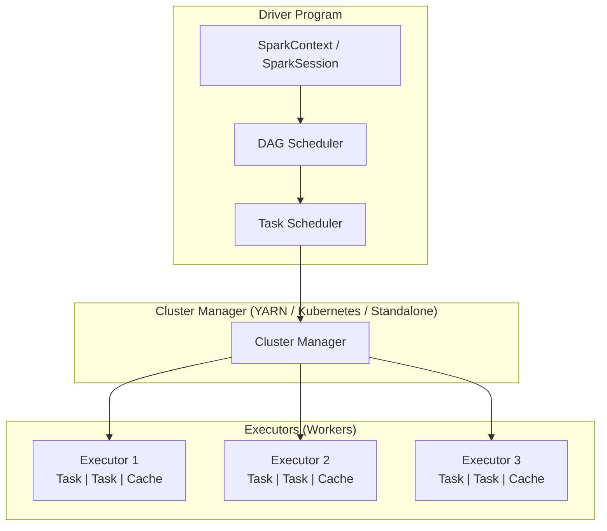
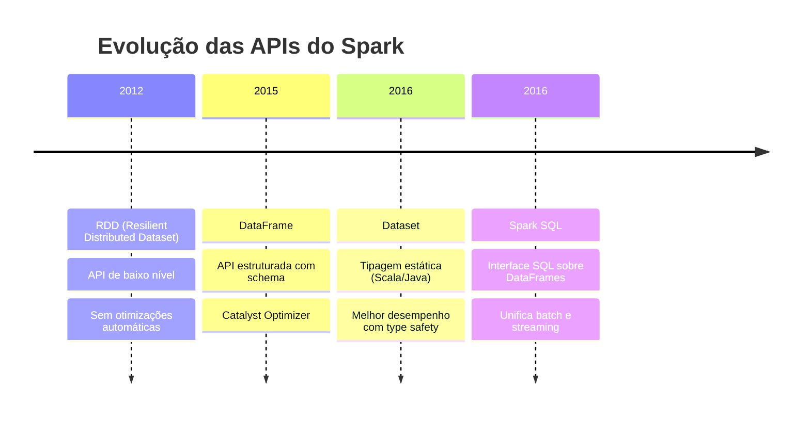
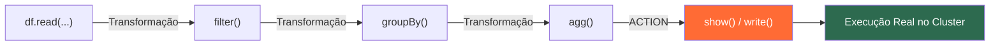
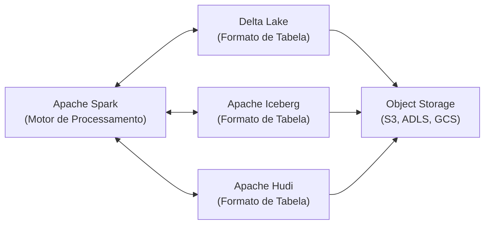

# Apache Spark / PySpark

## O que é o Apache Spark?

**Apache Spark** é um framework de processamento de dados distribuído e de código aberto, projetado para ser rápido, fácil de usar e escalável. Criado originalmente em 2009 na Universidade de Berkeley, o Spark se tornou um dos projetos mais ativos da Apache Software Foundation e é hoje o padrão de mercado para processamento de grandes volumes de dados (**Big Data**).

Diferente do Hadoop MapReduce, que grava resultados intermediários em disco, o Spark processa dados **em memória (in-memory)**, podendo ser até **100x mais rápido** para certas cargas de trabalho.

---

## Arquitetura do Spark



### Componentes principais

| Componente | Descrição |
|------------|-----------|
| **Driver** | Processo principal que coordena a execução. Contém o `SparkSession`. |
| **Cluster Manager** | Gerencia os recursos do cluster (YARN, Kubernetes, Standalone, Mesos). |
| **Executor** | Processo que executa as tarefas (tasks) nos nós workers. |
| **Task** | Unidade mínima de trabalho executada em um executor. |
| **Stage** | Conjunto de tasks que podem ser executadas em paralelo. |
| **Job** | Conjunto de stages que compõem uma ação (action) no Spark. |

---

## RDD, DataFrame e Dataset

O Spark evoluiu ao longo do tempo, oferecendo diferentes abstrações de dados:



### DataFrame (API mais usada em PySpark)

O **DataFrame** é a abstração principal em PySpark. É uma coleção distribuída de dados organizada em colunas nomeadas — similar a uma tabela de banco de dados ou um Pandas DataFrame, mas distribuído por um cluster.

```python
from pyspark.sql import SparkSession
from pyspark.sql.functions import col, when

spark = SparkSession.builder \
    .appName("Exemplo Spark") \
    .getOrCreate()

# Criar um DataFrame a partir de uma lista
df = spark.createDataFrame([
    (1, "Alice", 30),
    (2, "Bob", 25),
    (3, "Carlos", 35),
], schema=["id", "nome", "idade"])

# Operações de transformação (lazy)
df_filtrado = df.filter(col("idade") > 28) \
                .withColumn("categoria", when(col("idade") >= 30, "Senior").otherwise("Junior"))

# Action — dispara a execução real
df_filtrado.show()
```

---

## Lazy Evaluation

O Spark usa **avaliação preguiçosa (lazy evaluation)**. Transformações como `filter()`, `select()`, `join()` e `groupBy()` **não são executadas imediatamente** — elas constroem um plano de execução (DAG).

Somente quando uma **ação** é chamada (`show()`, `count()`, `write()`, `collect()`) o Spark executa todo o plano otimizado.



---

## PySpark: API Python para Spark

**PySpark** é a interface Python do Apache Spark. Permite usar todo o poder do Spark com a simplicidade e ecossistema do Python (pandas, numpy, matplotlib, etc.).

### Criando uma SparkSession

```python
from pyspark.sql import SparkSession

spark = SparkSession.builder \
    .appName("MeuApp") \
    .master("local[*]") \           # local com todos os cores disponíveis
    .config("spark.driver.memory", "4g") \
    .getOrCreate()

# Verificar a versão
print(f"Spark version: {spark.version}")
```

### Operações Fundamentais com DataFrames

```python
from pyspark.sql import functions as F

# Leitura de dados
df = spark.read.csv("dados.csv", header=True, inferSchema=True)

# Seleção de colunas
df.select("nome", "preco").show(5)

# Filtros
df.filter(F.col("preco") > 100).show()

# Agrupamento e agregação
df.groupBy("categoria") \
  .agg(
      F.count("*").alias("total"),
      F.avg("preco").alias("preco_medio"),
      F.sum("estoque").alias("estoque_total")
  ) \
  .orderBy(F.desc("total")) \
  .show()

# Join entre DataFrames
df_pedidos.join(df_clientes, on="cliente_id", how="inner") \
          .select("pedido_id", "nome", "valor_total") \
          .show()

# Adicionar coluna calculada
df = df.withColumn(
    "valor_com_desconto",
    F.col("preco") * 0.9
)
```

---

## Spark SQL

O Spark permite executar **SQL diretamente** sobre DataFrames, registrando-os como views temporárias:

```python
# Registrar DataFrame como view temporária
df_pedidos.createOrReplaceTempView("pedidos")
df_clientes.createOrReplaceTempView("clientes")

# Executar SQL padrão
resultado = spark.sql("""
    SELECT
        c.nome,
        c.cidade,
        COUNT(p.pedido_id)  AS total_pedidos,
        SUM(p.valor_total)  AS receita_total
    FROM pedidos p
    JOIN clientes c ON p.cliente_id = c.cliente_id
    WHERE p.status = 'ENTREGUE'
    GROUP BY c.nome, c.cidade
    ORDER BY receita_total DESC
    LIMIT 10
""")
resultado.show()
```

---

## Catalyst Optimizer e Tungsten

Dois mecanismos internos tornam o Spark extremamente eficiente:

### Catalyst Optimizer
Otimiza o plano lógico de execução automaticamente:
- **Predicate Pushdown**: move filtros para o início do plano.
- **Column Pruning**: lê apenas as colunas necessárias.
- **Join Reordering**: reordena joins para melhor desempenho.

### Tungsten Execution Engine
Otimiza o uso de memória e CPU:
- Geração de código JVM em tempo real (Whole Stage Code Generation).
- Gerenciamento de memória off-heap.
- Cache de CPU otimizado.

---

## Modos de Execução

| Modo | Descrição | Uso Típico |
|------|-----------|-----------|
| `local[1]` | Um único thread local | Testes simples |
| `local[*]` | Todos os cores da máquina local | Desenvolvimento |
| `local[N]` | N threads locais | Desenvolvimento controlado |
| `yarn` | Cluster Hadoop YARN | Produção on-premise |
| `kubernetes` | Cluster Kubernetes | Produção cloud-native |
| `spark://host:7077` | Cluster Standalone | Produção dedicada |

---

## Processamento Batch vs Streaming

O Spark suporta ambos os paradigmas com a mesma API:

```python
# Batch — lê todos os dados de uma vez
df_batch = spark.read.parquet("s3://meu-bucket/dados/")

# Streaming — lê dados em tempo real
df_stream = spark.readStream \
    .format("kafka") \
    .option("kafka.bootstrap.servers", "localhost:9092") \
    .option("subscribe", "topico") \
    .load()
```

---

## Integração com o Ecossistema Data Lakehouse

O Apache Spark é o motor de processamento padrão dos principais formatos de tabela do Data Lakehouse:



O padrão **Data Lakehouse** combina a flexibilidade e baixo custo de um Data Lake com as garantias ACID de um Data Warehouse — e o Apache Spark é a peça central que faz essa integração funcionar.
